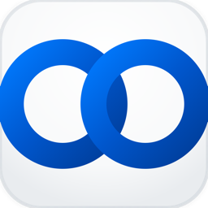
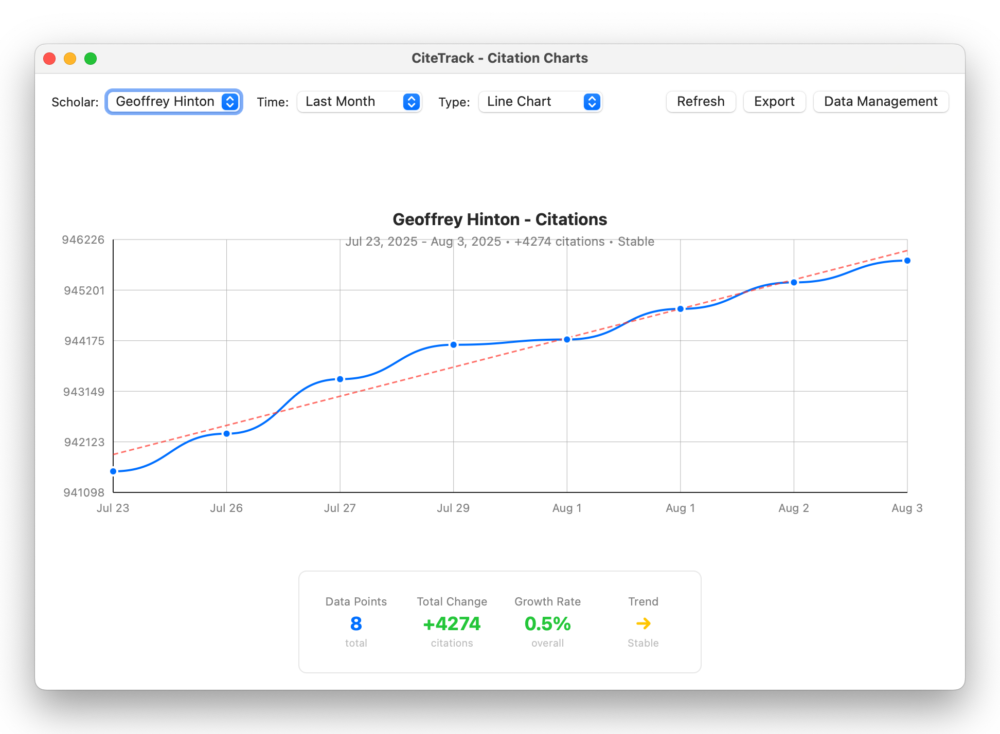

<div align="center">
  
  
  # CiteTrack
  
  **A professional multilingual macOS app for monitoring and visualizing Google Scholar citations**
  
  [](https://www.apple.com/macos/)
  [](https://swift.org/)
  [](LICENSE)
  [](https://github.com/tao-shen/CiteTrack/releases)
</div>

---

## ✨ Features

### 📊 Professional Chart System
- **Interactive Visualizations**: Line charts, bar charts, and area charts with real-time data
- **Historical Tracking**: Complete citation history with Core Data persistence
- **Time Range Filtering**: View data by week, month, quarter, year, or custom ranges
- **Advanced Analytics**: Trend analysis, growth rates, and statistical insights
- **Data Export**: Export charts and data to CSV/JSON formats

### 🔄 Smart Monitoring
- **Real-time Updates**: Automatically fetches Google Scholar citation data
- **Background Collection**: Intelligent data collection with configurable intervals
- **Change Notifications**: Smart alerts when citation counts change
- **Multiple Scholars**: Track unlimited scholars with individual dashboards

### 🌍 Multilingual Interface
- **7 Languages**: English, Chinese, Japanese, Korean, Spanish, French, German
- **Auto-detection**: Automatically detects system language
- **Live Switching**: Change languages without restarting

### 💾 Data Management
- **Core Data Integration**: Robust data persistence and migration
- **iCloud Sync**: Optional cloud synchronization across devices
- **Data Repair Tools**: Built-in tools for data validation and repair
- **History Management**: Complete citation history with timestamps

### 🎨 Modern UI
- **Native macOS Design**: Follows Apple's Human Interface Guidelines
- **Dark Mode Support**: Seamless adaptation to system themes
- **Responsive Layout**: Optimized for different window sizes
- **Menu Bar Integration**: Lightweight menu bar presence

## 🌍 Language Support

CiteTrack automatically detects your system language and supports:

- 🇺🇸 **English** (Full support)
- 🇨🇳 **简体中文** (Full support)
- 🇯🇵 **日本語** (Full support)
- 🇰🇷 **한국어** (Full support)
- 🇪🇸 **Español** (Full support)
- 🇫🇷 **Français** (Full support)
- 🇩🇪 **Deutsch** (Full support)

## 📥 Download

Download the latest version from the [Releases page](https://github.com/tao-shen/CiteTrack/releases/latest).

**Recommended:** Download `CiteTrack-Charts-v2.0.0.dmg` for the complete charts-enabled version.

## 🚀 Quick Start

1. Download the DMG file from releases
2. Open the DMG and drag CiteTrack.app to Applications
3. Launch CiteTrack and add your first scholar
4. Click the menu bar icon to view charts and statistics

## 📊 Chart System

### Visualization Options
- **Line Charts**: Perfect for trend analysis over time
- **Bar Charts**: Compare citation counts across different periods
- **Area Charts**: Visualize cumulative growth patterns

### Interactive Features
- **Hover Tooltips**: Detailed information on data points
- **Zoom & Pan**: Navigate through large datasets
- **Time Range Selector**: Custom date range selection with Apple-style pickers
- **Theme Options**: Multiple color schemes and themes

### Analytics Dashboard
- **Statistics Cards**: Key metrics at a glance
- **Trend Analysis**: Growth rates and change indicators
- **Insights Panel**: AI-powered insights about citation patterns
- **Export Tools**: Save charts as images or export data

### 📸 Example Screenshot

<div align="center">
  
  <br>
  <em>Tracking Geoffrey Hinton's Google Scholar citations with interactive charts and analytics</em>
</div>

## 🛠️ Development

### Requirements
- macOS 10.15+
- Xcode Command Line Tools
- Swift 5.0+

### Build from Source

```bash
# Clone the repository
git clone https://github.com/tao-shen/CiteTrack.git
cd CiteTrack

# Build the charts-enabled application
./scripts/build_charts.sh

# Create DMG installer
./scripts/create_charts_dmg.sh
```

### Project Structure

```
CiteTrack/
├── README.md                           # Project documentation
├── LICENSE                             # MIT license
├── .gitignore                          # Git ignore rules
├── Sources/                            # Swift source code
│   ├── main.swift                      # Main application entry
│   ├── Localization.swift              # Multilingual support
│   ├── SettingsWindow.swift            # Settings interface
│   ├── ChartsViewController.swift      # Chart visualization
│   ├── ChartView.swift                 # Custom chart rendering
│   ├── ChartDataService.swift          # Chart data processing
│   ├── CoreDataManager.swift           # Data persistence
│   ├── CitationHistoryManager.swift    # History management
│   ├── NotificationManager.swift       # Smart notifications
│   ├── iCloudSyncManager.swift         # Cloud synchronization
│   └── DataRepairViewController.swift  # Data management tools
├── scripts/                            # Build and deployment scripts
│   ├── build_charts.sh                 # Charts build script
│   ├── create_charts_dmg.sh            # DMG creation script
│   └── test_app.sh                     # Testing utilities
├── docs/                               # Project documentation
│   ├── CHART_STABILITY_IMPROVEMENTS.md # Chart system docs
│   └── ICLOUD_DEBUG_GUIDE.md          # iCloud integration guide
├── assets/                             # Project assets
│   ├── app_icon.icns                   # Application icon
│   └── logo.png                        # Project logo
├── Frameworks/                         # External dependencies
│   └── Sparkle.framework               # Auto-update framework
├── CiteTrack.entitlements              # App capabilities
└── Sources/CitationTrackingModel.xcdatamodeld/  # Core Data model
```

## 📊 Technical Specifications

- **Application Size:** ~4.9MB (with charts)
- **Installer Size:** ~2.1MB (DMG)
- **System Requirements:** macOS 10.15+
- **Architecture:** Universal (Intel & Apple Silicon)
- **Language:** Swift
- **Frameworks:** AppKit, Core Data, UserNotifications
- **Localization:** 7 languages supported
- **Data Storage:** Core Data with optional iCloud sync

## 🔒 Privacy & Security

CiteTrack is open source and privacy-friendly:
- ✅ **Open Source:** Full source code available
- ✅ **No Data Collection:** No personal information collected
- ✅ **Local Storage:** All data stored on your device
- ✅ **Optional Cloud Sync:** iCloud sync is opt-in only
- ✅ **Minimal Permissions:** Only accesses public Google Scholar data
- ✅ **Code Signed:** Uses ad-hoc signing for integrity

## 🆕 What's New in v2.0.0

### Major Features
- 📊 **Complete Chart System**: Professional data visualization with interactive charts
- 📱 **Modern UI**: Redesigned interface with native macOS styling
- 💾 **Core Data Integration**: Robust data persistence with migration support
- ☁️ **iCloud Sync**: Optional cloud synchronization across devices
- 🔔 **Smart Notifications**: Intelligent alerts for citation changes
- 🛠️ **Data Management**: Advanced tools for data repair and maintenance

### Technical Improvements
- Memory-safe async operations with proper cleanup
- Enhanced error handling and user feedback
- Background data collection service
- Fixed calendar display issues in date pickers
- Improved performance and stability

## 📝 Contributing

Contributions are welcome! Feel free to:
- Report bugs via [GitHub Issues](https://github.com/tao-shen/CiteTrack/issues)
- Suggest features through issues
- Submit pull requests
- Help with translations for additional languages

## 📄 License

This project is licensed under the MIT License. See the [LICENSE](LICENSE) file for details.

---

<div align="center">
  <strong>Made with ❤️ for the global academic community</strong>
  <br>
  <em>Visualize your research impact with professional charts and analytics</em>
</div>