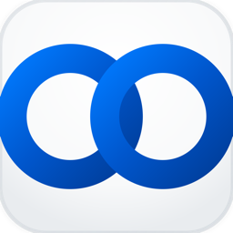

<div align="center">
  
  
  # CiteTrack
  
  **A professional multilingual macOS menu bar app for monitoring Google Scholar citation counts**
  
  [](https://www.apple.com/macos/)
  [](https://swift.org/)
  [](LICENSE)
  [](https://github.com/tao-shen/CiteTrack/releases)
</div>

---

## ✨ Features

- 🔄 **Real-time Monitoring**: Automatically fetches Google Scholar citation data at customizable intervals
- 👥 **Multi-Scholar Support**: Track multiple scholars with drag-and-drop reordering
- 🌍 **Multilingual Interface**: Supports 7 languages (English, Chinese, Japanese, Korean, Spanish, French, German)
- 🌗 **Theme Adaptation**: Menu bar icon adapts to system dark/light mode
- ⚙️ **Professional Settings**: Tabbed settings interface for General and Scholar management
- ⚡ **Lightweight**: Application size ~850KB
- 🔒 **Privacy First**: All data stored locally, no personal information collected

## 🌍 Language Support

CiteTrack automatically detects your system language and supports:

- 🇺🇸 **English** (Full support)
- 🇨🇳 **简体中文** (Full support)
- 🇯🇵 **日本語** (Full support)
- 🇰🇷 **한국어** (Full support)
- 🇪🇸 **Español** (Basic support)
- 🇫🇷 **Français** (Basic support)
- 🇩🇪 **Deutsch** (Basic support)

You can also manually switch languages in the settings without restarting the app.

## 📥 Download

Download the latest version from the [Releases page](https://github.com/tao-shen/CiteTrack/releases/latest).

**Recommended:** Download `CiteTrack-Multilingual-vX.Y.Z.dmg` for the full multilingual installer.

## 🚀 Quick Start

1. Download the DMG file from releases
2. Open the DMG file
3. If you see a security warning, run the included bypass script or right-click and select "Open"
4. Drag CiteTrack.app to your Applications folder

## 🛡️ Security Notice

CiteTrack uses ad-hoc code signing and is not notarized by Apple. This may trigger a security warning on first launch. This is normal and safe—the app is open-source and contains no malicious code.

### Bypass Security Warning
- **Automatic:** Run the included `bypass_security.sh` script
- **Manual:** Right-click CiteTrack.app → Select "Open" → Click "Open" in the dialog
- Or run: `xattr -dr com.apple.quarantine CiteTrack.app`

## 🖥️ Usage

1. **First Launch:** The app will guide you to add your first scholar
2. **Add Scholar:** Enter the Google Scholar profile URL or user ID
3. **View Data:** Click the ∞ menu bar icon to see citation statistics
4. **Manage Settings:** Access settings through the menu

### Settings Interface
- **General Tab:** Configure update intervals, language, display options, and startup preferences
- **Scholars Tab:** Manage your scholar list with drag-and-drop reordering, add/remove scholars

### Scholar Management
- Add scholars using their Google Scholar profile URL or user ID
- Drag and drop to reorder scholars
- View real-time citation counts and last update timestamps
- Customize update intervals from 30 minutes to 1 week

## 🛠️ Development

### Requirements
- macOS 10.15+
- Xcode Command Line Tools
- Swift 5.0+

### Build from Source

```bash
# Clone the repository
git clone https://github.com/tao-shen/CiteTrack.git
cd CiteTrack

# Build the multilingual application
./scripts/build.sh

# Create multilingual DMG installer
./scripts/create_dmg.sh
```

### Project Structure

```
CiteTrack/
├── README.md              # Project documentation
├── LICENSE                # MIT license
├── .gitignore             # Git ignore rules
├── Sources/               # Swift source code
│   ├── main_localized.swift
│   ├── Localization.swift
│   └── SettingsWindow.swift
├── scripts/               # Build and deployment scripts
│   ├── build.sh           # Main build script
│   ├── create_dmg.sh      # DMG creation script
│   └── bypass_security.sh # Security bypass tool
├── docs/                  # Project documentation
│   ├── FEATURES.md        # Feature documentation
│   └── CHANGELOG.md       # Version history
├── assets/                # Project assets
│   ├── app_icon.icns      # Application icon
│   └── logo.png           # Project logo
├── Frameworks/            # External dependencies
│   └── Sparkle.framework  # Auto-update framework
└── backup_files/          # Backups (not tracked by Git)
```

## 📊 Technical Specifications

- **Application Size:** ~850KB
- **Installer Size:** ~988KB (DMG)
- **System Requirements:** macOS 10.15+
- **Architecture:** Universal (Intel & Apple Silicon)
- **Language:** Swift
- **Framework:** AppKit
- **Localization:** 7 languages supported

## 🔒 Privacy & Security

CiteTrack is open source and privacy-friendly:
- ✅ **Open Source:** Full source code available
- ✅ **No Data Collection:** No personal information collected
- ✅ **Local Storage:** All data stored on your device
- ✅ **Minimal Permissions:** Only accesses public Google Scholar data
- ✅ **Code Signed:** Uses ad-hoc signing for integrity

## 📝 Contributing

Contributions are welcome! Feel free to:
- Report bugs via [GitHub Issues](https://github.com/tao-shen/CiteTrack/issues)
- Suggest features through issues
- Submit pull requests
- Help with translations for additional languages

## 📄 License

This project is licensed under the MIT License. See the [LICENSE](LICENSE) file for details.

---

<div align="center">
  <strong>Made with ❤️ for the global academic community</strong>
  <br>
  <em>Effortlessly track your research impact, in your language</em>
</div> 