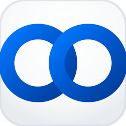
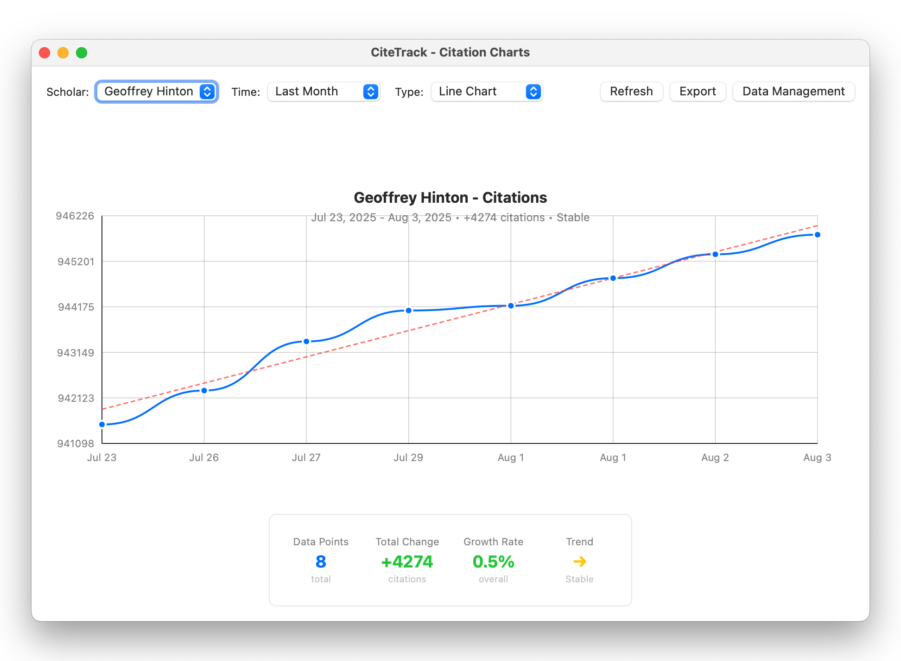

<div align="center">
  

  # CiteTrack

  ### Track Your Research Impact Across Devices

  **A cross-platform iOS & macOS application for monitoring, visualizing, and analyzing Google Scholar citations in real time**

  ---

  [](https://apps.apple.com/app/citetrack/id6752281652)
  [](https://apps.apple.com/app/citetrack/id6752281652)
  [](https://swift.org/)
  [](https://developer.apple.com/xcode/swiftui/)

  <br>

  [](https://apps.apple.com/app/citetrack/id6752281652)
  [](https://github.com/tao-shen/CiteTrack/releases/latest)

  <br>

  [](LICENSE)
  [](https://github.com/tao-shen/CiteTrack/stargazers)
  [](https://github.com/tao-shen/CiteTrack/network/members)
  [](https://github.com/tao-shen/CiteTrack/issues)
  [](https://github.com/tao-shen/CiteTrack/commits/main)
  [](https://github.com/tao-shen/CiteTrack)
  [](https://github.com/tao-shen/CiteTrack)
  [](https://github.com/tao-shen/CiteTrack)
  [](https://github.com/tao-shen/CiteTrack/pulls)
  [](https://github.com/tao-shen/CiteTrack/graphs/commit-activity)

  <br>

  [](https://scholar.google.com/)
  [](https://developer.apple.com/documentation/coredata)
  [](https://developer.apple.com/icloud/)
  [](https://developer.apple.com/widgets/)
  [](https://firebase.google.com/)
  [](https://sparkle-project.org/)

  <br>

  [](#-language-support)
  [](#-language-support)
  [](#-language-support)
  [](#-language-support)
  [](#-language-support)
  [](#-language-support)
  [](#-language-support)

</div>

---

## Screenshots

<div align="center">
  
  <br>
  <em>macOS: Tracking Geoffrey Hinton's Google Scholar citations with interactive charts and analytics</em>
</div>

---

## Highlights

| | Feature | Description |
|---|---|---|
| **Cross-Platform** | iOS + macOS | One codebase, shared logic, native UI on each platform |
| **Real-Time Tracking** | Auto-refresh | Monitor citation counts with configurable update intervals |
| **Interactive Charts** | Line / Bar / Area / Heatmap | Professional data visualization with zoom, pan, and tooltips |
| **Who Cited Me** | Reverse lookup | Discover which papers cite your publications and explore citing authors |
| **Home Screen Widgets** | WidgetKit | Glanceable citation stats right on your iOS home screen |
| **Menu Bar App** | macOS native | Lightweight menu bar presence with quick access to stats |
| **iCloud Sync** | CloudKit | Seamlessly sync scholar data across all your Apple devices |
| **7 Languages** | i18n | English, Chinese, Japanese, Korean, Spanish, French, German |
| **Smart Alerts** | Notifications | Get notified instantly when your citation counts change |
| **Data Export** | CSV / JSON | Export citation history for use in other tools |
| **Dark Mode** | System adaptive | Beautiful in both light and dark themes |
| **Open Source** | MIT License | Fully transparent, community-driven development |

---

## Architecture

```
┌─────────────────────────────────────────────────────────────────────┐
│                          CiteTrack                                  │
├───────────────────────┬─────────────────────────────────────────────┤
│                       │                                             │
│   ┌───────────────┐   │   ┌───────────────────────────────────┐     │
│   │   iOS App      │   │   │          macOS App                │     │
│   │  (SwiftUI)     │   │   │         (AppKit)                  │     │
│   ├───────────────┤   │   ├───────────────────────────────────┤     │
│   │ Dashboard      │   │   │ Menu Bar Controller               │     │
│   │ Scholar List   │   │   │ Settings Window                   │     │
│   │ Charts View    │   │   │ Charts Window (Modern/Classic)    │     │
│   │ Who Cited Me   │   │   │ Data Repair Tools                 │     │
│   │ Settings       │   │   │ Notification Popups               │     │
│   │ Widget Ext.    │   │   │ Dashboard Components              │     │
│   └───────┬───────┘   │   └──────────┬────────────────────────┘     │
│           │           │              │                               │
├───────────┴───────────┴──────────────┴───────────────────────────────┤
│                                                                      │
│                    Shared Framework Layer                             │
│  ┌────────────────────────────────────────────────────────────────┐  │
│  │                                                                │  │
│  │  ┌──────────────┐  ┌──────────────┐  ┌──────────────────────┐ │  │
│  │  │   Services    │  │   Managers    │  │      Models          │ │  │
│  │  ├──────────────┤  ├──────────────┤  ├──────────────────────┤ │  │
│  │  │ CitationFetch│  │ Citation     │  │ Scholar              │ │  │
│  │  │ GoogleScholar│  │ CloudKitSync │  │ CitationHistory      │ │  │
│  │  │ ScholarData  │  │ AppConfig    │  │ CitingPaper          │ │  │
│  │  │ Notification │  │ UserDefaults │  │ CitingAuthor         │ │  │
│  │  │ CloudKitSync │  │ iCloudSync   │  │ CitationStatistics   │ │  │
│  │  │ CitationCache│  │              │  │ CitationFilter       │ │  │
│  │  │ DataSync     │  │              │  │ WidgetModels         │ │  │
│  │  │ Export       │  │              │  │ ExportFormat         │ │  │
│  │  │ Widget Data  │  │              │  │                      │ │  │
│  │  │ Analytics    │  │              │  │                      │ │  │
│  │  │ Backup       │  │              │  │                      │ │  │
│  │  └──────────────┘  └──────────────┘  └──────────────────────┘ │  │
│  │                                                                │  │
│  │  ┌──────────────────────────────────────────────────────────┐  │  │
│  │  │                    Core Data Stack                       │  │  │
│  │  │  CitationTrackingModel.xcdatamodeld                      │  │  │
│  │  │  ┌─────────┐  ┌───────────────┐  ┌──────────────────┐   │  │  │
│  │  │  │ Scholar  │──│ CitationEntry │──│ CitationHistory  │   │  │  │
│  │  │  └─────────┘  └───────────────┘  └──────────────────┘   │  │  │
│  │  └──────────────────────────────────────────────────────────┘  │  │
│  │                                                                │  │
│  └────────────────────────────────────────────────────────────────┘  │
│                                                                      │
├──────────────────────────────────────────────────────────────────────┤
│                       External Services                              │
│  ┌──────────────┐  ┌──────────────┐  ┌──────────────────────────┐   │
│  │Google Scholar │  │   iCloud /   │  │  Firebase Analytics      │   │
│  │   (scraping)  │  │  CloudKit    │  │  (event tracking)        │   │
│  └──────────────┘  └──────────────┘  └──────────────────────────┘   │
└──────────────────────────────────────────────────────────────────────┘
```

---

## Installation

### Option 1: App Store (Recommended)

<div align="center">

  [](https://apps.apple.com/app/citetrack/id6752281652)

  Available for both **iPhone / iPad** and **Mac**.

</div>

### Option 2: GitHub Release (macOS DMG)

1. Go to the [Releases page](https://github.com/tao-shen/CiteTrack/releases/latest)
2. Download `CiteTrack.dmg`
3. Open the DMG and drag **CiteTrack.app** into your **Applications** folder
4. Launch CiteTrack from Applications

### Option 3: Build from Source

```bash
# Clone the repository
git clone https://github.com/tao-shen/CiteTrack.git
cd CiteTrack

# Build macOS app
cd macOS
xcodebuild -project CiteTrack_macOS.xcodeproj \
           -scheme CiteTrack \
           -configuration Release \
           build

# Build iOS app
cd ../iOS
xcodebuild -project CiteTrack_iOS.xcodeproj \
           -scheme CiteTrack \
           -configuration Release \
           -destination 'generic/platform=iOS' \
           build
```

**Requirements:**
- macOS 14.0+ (for building)
- Xcode 15.0+
- Swift 5.9+
- Apple Developer account (for iOS device deployment)

---

## Features in Detail

### Citation Tracking & Monitoring

Add scholars by their Google Scholar profile URL or ID. CiteTrack periodically fetches the latest citation data and stores it locally with Core Data. Configure update intervals from 1 hour to daily.

### Interactive Charts

| Platform | Chart Types | Features |
|----------|------------|----------|
| **iOS** | Line, Bar, Heatmap | Time range picker, data point selection, SwiftUI native |
| **macOS** | Line, Bar, Area | Zoom/pan, hover tooltips, custom themes, multiple chart styles |

Both platforms support filtering by time range: week, month, quarter, year, or custom date ranges.

### Who Cited Me

Discover which papers cite your publications. Browse citing papers with details including:
- Paper title, authors, and publication year
- Abstract preview
- Direct links to the paper and citing authors' profiles
- Filter by year, keyword, or author
- Export results to CSV or JSON

### Home Screen Widgets (iOS)

WidgetKit-powered widgets show citation stats at a glance:
- Total citation count
- Recent changes with delta indicators
- Quick access to the full app via deep links

### Menu Bar App (macOS)

Runs unobtrusively in the menu bar with:
- Quick citation count overview
- One-click refresh
- Notification popups for citation changes
- Access to the full charts window

### iCloud Sync

Enable iCloud to sync your scholar list and citation data across all your Apple devices. Works with both iOS and macOS apps via CloudKit.

### Smart Notifications

Get notified when citation counts change:
- System notifications on both platforms
- Popup windows on macOS with quick chart access
- Badge counts on iOS

---

## Language Support

CiteTrack automatically detects your system language. Supported languages:

| Language | Status |
|----------|--------|
| English | Full support |
| Chinese (Simplified) | Full support |
| Japanese | Full support |
| Korean | Full support |
| Spanish | Full support |
| French | Full support |
| German | Full support |

---

## Project Structure

```
CiteTrack/
├── iOS/                                # iOS application
│   ├── CiteTrack/                      # Main iOS app target
│   │   ├── CiteTrackApp.swift          # App entry point (SwiftUI)
│   │   └── Views/                      # SwiftUI views
│   │       ├── ChartViews.swift        # Citation chart visualizations
│   │       ├── WhoCiteMeView.swift     # Citing papers browser
│   │       ├── SelectionViews.swift    # Theme, language, settings pickers
│   │       ├── CitationFilterView.swift
│   │       ├── CitationStatisticsView.swift
│   │       └── ...
│   ├── CiteTrackWidgetExtension/       # Home screen widget
│   └── CiteTrack_iOS.xcodeproj
│
├── macOS/                              # macOS application
│   ├── Sources/                        # AppKit source files
│   │   ├── main.swift                  # App entry point
│   │   ├── MainAppDelegate.swift       # Menu bar controller
│   │   ├── SettingsWindow.swift        # Preferences window
│   │   ├── ModernChartsViewController.swift
│   │   ├── ChartView.swift             # Custom chart rendering
│   │   ├── Localization.swift          # i18n support
│   │   ├── CoreDataManager.swift       # macOS Core Data
│   │   ├── NotificationManager.swift   # Alert system
│   │   └── ...                         # 30 source files
│   ├── assets/                         # App icon, logo, screenshots
│   ├── Frameworks/                     # Sparkle.framework (auto-update)
│   └── CiteTrack_macOS.xcodeproj
│
├── Shared/                             # Cross-platform shared code
│   ├── Services/                       # Business logic services
│   │   ├── CitationFetchService.swift  # Google Scholar data fetching
│   │   ├── AnalyticsService.swift      # Firebase Analytics wrapper
│   │   ├── CloudKitSyncService.swift   # iCloud synchronization
│   │   ├── ScholarDataService.swift    # Scholar CRUD operations
│   │   ├── WidgetDataService.swift     # Widget data provider
│   │   └── ...                         # 17 service files
│   ├── Managers/                       # State & configuration managers
│   │   ├── CitationManager.swift       # Citation change detection
│   │   ├── AppConfigManager.swift      # App settings
│   │   └── ...                         # 7 manager files
│   ├── Models/                         # Data models
│   │   ├── Scholar.swift               # Scholar entity
│   │   ├── CitingPaper.swift           # Citing paper model
│   │   ├── CitationHistory.swift       # Historical records
│   │   └── ...                         # 8 model files
│   ├── CoreData/                       # Core Data stack & migrations
│   ├── Localization/                   # Localized strings (7 languages)
│   └── Tests/                          # Shared unit tests
│
├── scripts/                            # Build & deployment scripts
├── docs/                               # Technical documentation
└── submit/                             # App Store submission assets
```

---

## Tech Stack

| Component | Technology |
|-----------|-----------|
| **iOS UI** | SwiftUI, WidgetKit |
| **macOS UI** | AppKit, Custom Chart Engine |
| **Data Persistence** | Core Data |
| **Cloud Sync** | CloudKit / iCloud |
| **Analytics** | Firebase Analytics |
| **Auto-Update** | Sparkle Framework (macOS) |
| **Networking** | URLSession |
| **Data Parsing** | Google Scholar HTML scraping |
| **Localization** | NSLocalizedString (7 languages) |
| **Architecture** | MVVM + Service Layer |
| **CI/CD** | Xcode Build, App Store Connect API |

---

## Roadmap

- [ ] **Citation Source Tracking** — Monitor exactly how other papers cite your publications, with context snippets and citation categorization
- [ ] Citation trend predictions with ML
- [ ] Collaboration network visualization
- [ ] PDF library integration
- [ ] Additional language support

> **Coming Soon:** Our top priority is building a citation source monitoring system that tracks *how* other papers reference your work — giving you deeper insight into your research impact beyond just numbers.

---

## Privacy & Security

CiteTrack is designed with privacy as a core principle:

- **Open Source** — Full source code available for audit
- **Local-First** — All data stored on-device by default
- **No Account Required** — Use the app without creating any account
- **Optional iCloud** — Cloud sync is strictly opt-in
- **Minimal Data Access** — Only fetches publicly available Google Scholar pages
- **No Tracking** — No third-party advertising or user profiling

---

## Contributing

Contributions are welcome! Here's how you can help:

1. **Report Bugs** — Open an [issue](https://github.com/tao-shen/CiteTrack/issues) with steps to reproduce
2. **Request Features** — Suggest improvements via issues
3. **Submit PRs** — Fork the repo, make changes, and submit a pull request
4. **Translations** — Help translate CiteTrack into more languages
5. **Star the Repo** — If CiteTrack helps your research, consider giving it a star!

---

## License

This project is licensed under the **MIT License**. See the [LICENSE](LICENSE) file for details.

---

## About

**CiteTrack** is built and maintained by [Tao Shen](https://github.com/tao-shen), a researcher who wanted a better way to keep track of citation metrics without constantly checking Google Scholar manually.

If you find CiteTrack useful for your academic work, feel free to share it with your colleagues or give the project a star on GitHub!

<div align="center">
  <br>

  **[App Store](https://apps.apple.com/app/citetrack/id6752281652)** · **[GitHub Releases](https://github.com/tao-shen/CiteTrack/releases)** · **[Report Bug](https://github.com/tao-shen/CiteTrack/issues)** · **[Request Feature](https://github.com/tao-shen/CiteTrack/issues)**

  <br>

  <sub>Built for researchers, by a researcher.</sub>

</div>
